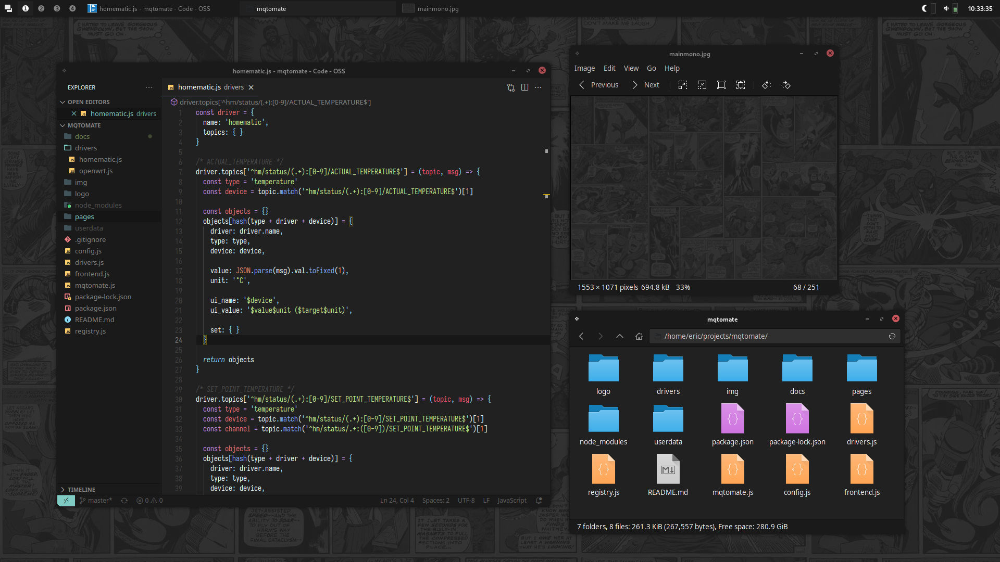

# yada-gtk

yada-gtk (yet another dark arc-theme) is yet another dark theme for GTK2 and GTK3 based on
[Arc-Theme](https://github.com/jnsh/arc-theme). Yada-GTK is not really a theme on its own,
but rather a script that, replaces the default colors to a more monochrome and dark ambiance.

The latest build can be found at the [Release Page](https://github.com/shagu/yada-gtk-theme/releases).

To adjust the colors to your likings and build your own, please follow the [Arc-Theme instructions](https://github.com/jnsh/arc-theme/blob/master/INSTALL.md)
to install all dependencies. You can then modify and run the `Makefile` in this repository.

## Screenshots

*(Awesome WM, VS Code, Eye of Mate, Thunar)*

*(Awesome WM, Pluma, Eye of Mate, Thunar, Conky)*
